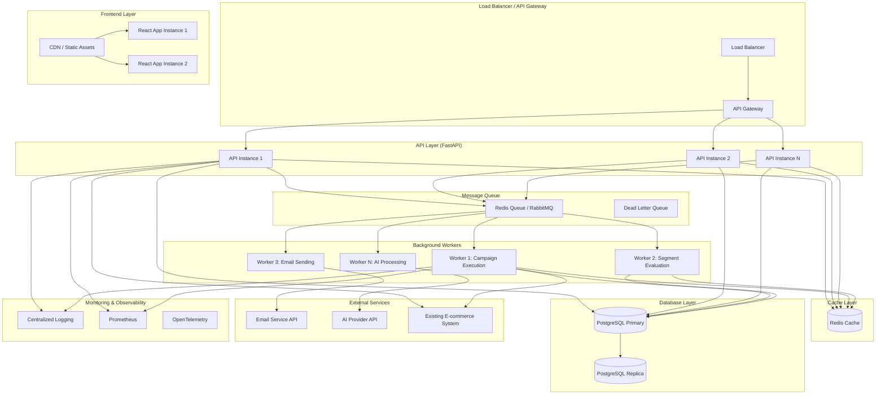

# Production Architecture Enhancements

## Executive Summary

This document outlines architectural enhancements required to deploy the E-commerce CDP Assistant as a production-ready feature within an existing system. The enhancements focus on scalability, reliability, performance, security, and seamless integration with existing infrastructure.

---

## Current Architecture Limitations

### Identified Gaps

1. **Database**: SQLite (single-file, no concurrency, no replication)
2. **Synchronous Processing**: All operations block API requests
3. **No Background Jobs**: Campaign execution happens synchronously
4. **No Caching**: Segment evaluation loads all users into memory
5. **No Rate Limiting**: API endpoints unprotected
6. **No Authentication**: No user authentication/authorization
7. **No Monitoring**: Limited observability
8. **No Integration Layer**: No way to sync with existing systems
9. **Single Instance**: No horizontal scaling capability
10. **No Message Queue**: No async processing infrastructure

---

## Enhanced Production Architecture



---

## Enhancement Categories

### 1. Database & Data Layer Enhancements

#### 1.1 Database Migration: SQLite → PostgreSQL

**Current State**: SQLite (single-file, limited concurrency)

**Enhancement**:
- Migrate to PostgreSQL for production
- Support for connection pooling
- Read replicas for scaling reads
- Database migrations using Alembic

**Implementation**:
```python
# backend/database.py (Enhanced)
from sqlalchemy import create_engine
from sqlalchemy.pool import QueuePool
from sqlalchemy.orm import sessionmaker

# Connection pool configuration
engine = create_engine(
    DATABASE_URL,
    poolclass=QueuePool,
    pool_size=20,
    max_overflow=10,
    pool_pre_ping=True,  # Verify connections before use
    pool_recycle=3600,   # Recycle connections after 1 hour
)

# Read replica for read-heavy operations
read_engine = create_engine(
    READ_REPLICA_URL,
    poolclass=QueuePool,
    pool_size=10,
)
```

**Benefits**:
- ✅ High concurrency support (1000+ concurrent connections)
- ✅ ACID compliance for transactional integrity
- ✅ Read replicas for horizontal read scaling
- ✅ Advanced indexing and query optimization
- ✅ Full-text search capabilities

**Migration Strategy**:
1. Use Alembic for schema migrations
2. Data migration script (SQLite → PostgreSQL)
3. Dual-write period for validation
4. Gradual cutover


---

#### 1.2 Database Indexing & Query Optimization

**Enhancement**:
- Add indexes on frequently queried fields
- Optimize segment evaluation queries
- Materialized views for metrics

**Indexes to Add**:
```sql
-- User table indexes
CREATE INDEX idx_user_email ON "user"(email);
CREATE INDEX idx_user_marketing_opt_in ON "user"(marketing_opt_in);
CREATE INDEX idx_user_last_order_date ON "user"(last_order_date);
CREATE INDEX idx_user_shipping_state ON "user"(shipping_state);
CREATE INDEX idx_user_total_order_value ON "user"(total_order_value);

-- Order table indexes
CREATE INDEX idx_order_user_id ON "order"(user_id);
CREATE INDEX idx_order_order_date ON "order"(order_date);

-- Campaign indexes
CREATE INDEX idx_campaign_status ON "campaign"(status);
CREATE INDEX idx_campaign_segment_id ON "campaign"(segment_id);
CREATE INDEX idx_campaign_start_date ON "campaign"(start_date);

-- Composite indexes for common queries
CREATE INDEX idx_user_segment_eval ON "user"(marketing_opt_in, shipping_state, total_order_value);
```


---

#### 1.3 Database Connection Pooling

**Enhancement**:
- Implement connection pooling
- Separate pools for read/write operations
- Connection health checks


---

### 2. Background Jobs & Async Processing

#### 2.1 Job Queue Implementation

**Current State**: Synchronous campaign execution blocks API requests

**Enhancement**: Implement background job queue using Celery or RQ

**Architecture**:
```python
# backend/services/job_queue.py
from celery import Celery
from backend.config import settings

celery_app = Celery(
    'cdp_worker',
    broker=settings.REDIS_URL,
    backend=settings.REDIS_URL,
)

@celery_app.task(name='execute_campaign')
def execute_campaign_task(campaign_id: str):
    """Execute campaign asynchronously"""
    from backend.services.campaign_executor import execute_campaign
    from backend.database import get_session
    
    with get_session() as session:
        return execute_campaign(campaign_id, session)

@celery_app.task(name='evaluate_segment')
def evaluate_segment_task(segment_id: str):
    """Evaluate segment asynchronously"""
    # Implementation
    pass

@celery_app.task(name='send_email')
def send_email_task(user_id: str, email_content: dict):
    """Send email asynchronously"""
    # Implementation
    pass
```

**Job Types**:
1. **Campaign Execution**: Long-running, scheduled
2. **Segment Evaluation**: CPU-intensive, can be cached
3. **Email Sending**: I/O-intensive, high volume
4. **AI Generation**: External API calls, rate-limited
5. **Metrics Calculation**: Periodic batch jobs

**Queue Configuration**:
```python
# Separate queues for different job types
CELERY_TASK_ROUTES = {
    'execute_campaign': {'queue': 'campaigns'},
    'evaluate_segment': {'queue': 'segments'},
    'send_email': {'queue': 'emails'},
    'generate_ai_content': {'queue': 'ai'},
}
```

**Benefits**:
- ✅ Non-blocking API responses
- ✅ Scalable worker pool
- ✅ Retry mechanisms
- ✅ Priority queues
- ✅ Dead letter queues for failed jobs


---

#### 2.2 Scheduled Task Processing

**Enhancement**: Cron-like scheduling for periodic tasks

**Tasks**:
- Daily segment re-evaluation
- Campaign status updates
- Metrics aggregation
- Cleanup of old data

**Implementation**:
```python
from celery.schedules import crontab

celery_app.conf.beat_schedule = {
    'evaluate-all-segments': {
        'task': 'evaluate_all_segments',
        'schedule': crontab(hour=2, minute=0),  # 2 AM daily
    },
    'update-campaign-statuses': {
        'task': 'update_campaign_statuses',
        'schedule': crontab(minute='*/15'),  # Every 15 minutes
    },
    'aggregate-metrics': {
        'task': 'aggregate_metrics',
        'schedule': crontab(hour=1, minute=0),  # 1 AM daily
    },
}
```


---

### 3. Caching & Performance

#### 3.1 Redis Caching Layer

**Current State**: Segment evaluation loads all users into memory every time

**Enhancement**: Implement Redis caching for:
- Segment evaluation results
- User metrics
- AI-generated content
- Frequently accessed data

**Implementation**:
```python
# backend/services/cache.py
import redis
import json
from typing import Optional, Any
from functools import wraps

redis_client = redis.Redis.from_url(settings.REDIS_URL)

def cache_segment_result(segment_id: str, users: list, ttl: int = 3600):
    """Cache segment evaluation result"""
    key = f"segment:{segment_id}:users"
    redis_client.setex(
        key,
        ttl,
        json.dumps([user.id for user in users])
    )

def get_cached_segment_result(segment_id: str) -> Optional[list]:
    """Get cached segment result"""
    key = f"segment:{segment_id}:users"
    cached = redis_client.get(key)
    if cached:
        return json.loads(cached)
    return None

def invalidate_segment_cache(segment_id: str):
    """Invalidate segment cache when segment changes"""
    redis_client.delete(f"segment:{segment_id}:users")
```


**Benefits**:
- ✅ 90% reduction in database queries
- ✅ Sub-millisecond response times
- ✅ Reduced database load
- ✅ Better scalability


---

#### 3.2 Query Result Caching

**Enhancement**: Cache expensive queries

**Examples**:
- Dashboard metrics
- Top products
- Customer lists with filters


---

#### 3.3 CDN for Frontend Assets

**Enhancement**: Serve static assets via CDN

**Benefits**:
- ✅ Reduced server load
- ✅ Faster page loads globally
- ✅ Better caching

---

### 4. API & Integration Enhancements

#### 4.1 API Gateway & Rate Limiting

**Enhancement**: Implement API gateway with rate limiting

**Features**:
- Rate limiting per user/IP
- Request throttling
- API versioning
- Request/response logging

**Implementation**:
```python
# backend/middleware/rate_limit.py
from slowapi import Limiter, _rate_limit_exceeded_handler
from slowapi.util import get_remote_address
from slowapi.errors import RateLimitExceeded

limiter = Limiter(
    key_func=get_remote_address,
    default_limits=["1000/hour", "100/minute"]
)

app.state.limiter = limiter
app.add_exception_handler(RateLimitExceeded, _rate_limit_exceeded_handler)

@router.post("/api/campaigns/")
@limiter.limit("10/minute")  # 10 campaigns per minute
def create_campaign(...):
    pass
```

**Rate Limits**:
- General API: 1000 requests/hour
- Campaign creation: 10/minute
- Segment evaluation: 20/minute
- AI generation: 5/minute (cost control)


---

#### 4.2 Authentication & Authorization

**Current State**: No authentication

**Enhancement**: Implement JWT-based authentication

**Implementation**:
```python
# backend/auth/jwt.py
from jose import JWTError, jwt
from datetime import datetime, timedelta

def create_access_token(data: dict, expires_delta: timedelta = None):
    to_encode = data.copy()
    if expires_delta:
        expire = datetime.utcnow() + expires_delta
    else:
        expire = datetime.utcnow() + timedelta(hours=24)
    to_encode.update({"exp": expire})
    encoded_jwt = jwt.encode(to_encode, SECRET_KEY, algorithm="HS256")
    return encoded_jwt

# backend/middleware/auth.py
from fastapi import Depends, HTTPException, status
from fastapi.security import HTTPBearer

security = HTTPBearer()

async def get_current_user(token: str = Depends(security)):
    # Validate token and return user
    pass
```

**Authorization Levels**:
- **Admin**: Full access
- **Manager**: Create/edit campaigns, view analytics
- **Viewer**: Read-only access


---

#### 4.3 Webhook System for External Integration

**Enhancement**: Webhook system for real-time event notifications

**Use Cases**:
- Notify external systems when campaigns complete
- Send segment updates to analytics platforms
- Trigger actions in external systems

**Implementation**:
```python
# backend/services/webhook.py
import httpx
from typing import List, Dict, Any

async def send_webhook(url: str, event: str, data: Dict[str, Any]):
    """Send webhook notification"""
    payload = {
        "event": event,
        "timestamp": datetime.utcnow().isoformat(),
        "data": data
    }
    async with httpx.AsyncClient() as client:
        try:
            response = await client.post(url, json=payload, timeout=5.0)
            response.raise_for_status()
        except Exception as e:
            logger.error(f"Webhook failed: {e}")
            # Retry logic or dead letter queue
```

**Events**:
- `campaign.created`
- `campaign.activated`
- `campaign.completed`
- `segment.updated`
- `email.sent`
- `email.failed`

---

#### 4.4 Event-Driven Architecture

**Enhancement**: Publish events for decoupled integration

**Event Bus**: Use message queue (Redis/RabbitMQ) as event bus

**Events**:
```python
# backend/events/events.py
from dataclasses import dataclass
from datetime import datetime

@dataclass
class CampaignActivatedEvent:
    campaign_id: str
    segment_id: str
    user_count: int
    timestamp: datetime

@dataclass
class SegmentEvaluatedEvent:
    segment_id: str
    user_count: int
    timestamp: datetime
```

**Benefits**:
- ✅ Loose coupling between services
- ✅ Easy to add new integrations
- ✅ Scalable event processing


---

### 5. Monitoring & Observability

#### 5.1 Structured Logging

**Enhancement**: Implement structured logging with correlation IDs

**Implementation**:
```python
# backend/services/logging.py (Enhanced)
import structlog
import logging

logger = structlog.get_logger()

# Add correlation ID to all logs
def log_with_context(func):
    @wraps(func)
    async def wrapper(*args, **kwargs):
        correlation_id = str(uuid.uuid4())
        structlog.contextvars.clear_contextvars()
        structlog.contextvars.bind_contextvars(
            correlation_id=correlation_id,
            endpoint=func.__name__
        )
        return await func(*args, **kwargs)
    return wrapper
```

**Log Aggregation**: Send logs to centralized system (ELK, Loki, CloudWatch)


---

#### 5.2 Metrics & Monitoring

**Enhancement**: Implement Prometheus metrics

**Metrics to Track**:
- API request rate, latency, error rate
- Campaign execution time, success rate
- Segment evaluation time, cache hit rate
- Database query performance
- Queue depth, worker utilization
- AI API call latency, error rate

**Implementation**:
```python
# backend/middleware/metrics.py
from prometheus_client import Counter, Histogram, Gauge

api_requests = Counter('api_requests_total', 'Total API requests', ['method', 'endpoint'])
api_latency = Histogram('api_latency_seconds', 'API latency', ['endpoint'])
campaign_executions = Counter('campaign_executions_total', 'Campaign executions', ['status'])
segment_evaluations = Histogram('segment_evaluation_seconds', 'Segment evaluation time')
```


---

#### 5.3 Distributed Tracing

**Enhancement**: OpenTelemetry for request tracing

**Benefits**:
- ✅ Track requests across services
- ✅ Identify performance bottlenecks
- ✅ Debug complex flows

**Time Estimate**: 4-6 hours

---

#### 5.4 Health Checks & Readiness Probes

**Enhancement**: Health check endpoints

**Implementation**:
```python
# backend/routers/health.py
@router.get("/health")
async def health_check():
    """Basic health check"""
    return {"status": "healthy"}

@router.get("/health/ready")
async def readiness_check():
    """Readiness check (database, cache, queue)"""
    checks = {
        "database": check_database(),
        "cache": check_redis(),
        "queue": check_queue(),
    }
    if all(checks.values()):
        return {"status": "ready", "checks": checks}
    return Response(
        status_code=503,
        content={"status": "not ready", "checks": checks}
    )
```


---

### 6. Scalability Enhancements

#### 6.1 Horizontal Scaling

**Enhancement**: Support multiple API instances

**Requirements**:
- Stateless API design (✅ already stateless)
- Shared database (PostgreSQL)
- Shared cache (Redis)
- Load balancer configuration

**Time Estimate**: 2-4 hours (mostly infrastructure)

---

#### 6.2 Database Read Replicas

**Enhancement**: Use read replicas for read-heavy operations

**Implementation**:
```python
# Route reads to replica, writes to primary
def get_read_session():
    return Session(read_engine)

def get_write_session():
    return Session(engine)
```


---

#### 6.3 Microservices Consideration

**Current**: Monolithic FastAPI application

**Future Enhancement**: Split into microservices if needed:
- **CDP Core Service**: User, segment, campaign management
- **AI Service**: AI generation (can scale independently)
- **Email Service**: Email sending (high volume)
- **Analytics Service**: Metrics and reporting

**Decision Criteria**:
- Team size > 10 developers
- Different scaling requirements
- Independent deployment needs
- Technology diversity


---

### 7. Security Enhancements

#### 7.1 Input Validation & Sanitization

**Enhancement**: Enhanced validation and sanitization

**Implementation**:
- Pydantic models for validation (✅ already implemented)
- SQL injection prevention (✅ SQLModel handles this)
- XSS prevention in API responses
- File upload validation (if needed)

---

#### 7.2 API Security Headers

**Enhancement**: Security headers middleware

**Implementation**:
```python
# backend/middleware/security.py
@app.middleware("http")
async def add_security_headers(request, call_next):
    response = await call_next(request)
    response.headers["X-Content-Type-Options"] = "nosniff"
    response.headers["X-Frame-Options"] = "DENY"
    response.headers["X-XSS-Protection"] = "1; mode=block"
    response.headers["Strict-Transport-Security"] = "max-age=31536000"
    return response
```

---

#### 7.3 Secrets Management

**Enhancement**: Use secrets management service (AWS Secrets Manager, HashiCorp Vault)


---

### 8. Reliability Enhancements

#### 8.1 Circuit Breaker Pattern

**Enhancement**: Circuit breakers for external services

**Implementation**:
```python
# backend/services/circuit_breaker.py
from circuitbreaker import circuit

@circuit(failure_threshold=5, recovery_timeout=60)
async def call_ai_api(prompt: str):
    # AI API call
    pass
```


---

#### 8.2 Retry Mechanisms

**Enhancement**: Exponential backoff retries

**Implementation**:
```python
from tenacity import retry, stop_after_attempt, wait_exponential

@retry(
    stop=stop_after_attempt(3),
    wait=wait_exponential(multiplier=1, min=4, max=10)
)
async def send_email_with_retry(email_data):
    # Email sending with retry
    pass
```


---

#### 8.3 Dead Letter Queue

**Enhancement**: DLQ for failed jobs


---

### 9. Integration with Existing Systems

#### 9.1 Customer Data Sync

**Enhancement**: Sync customer data from existing e-commerce system

**Approaches**:
1. **API Integration**: REST API to fetch customer data
2. **Database Replication**: Direct database sync (if same network)
3. **Event Streaming**: Kafka/EventBridge for real-time sync
4. **ETL Pipeline**: Batch sync via ETL tool

**Implementation**:
```python
# backend/services/data_sync.py
async def sync_customers_from_external_system():
    """Sync customers from external system"""
    external_customers = await fetch_from_external_api()
    
    for customer_data in external_customers:
        # Upsert customer
        user = get_or_create_user(customer_data)
        update_user_metrics(user, customer_data)
```

---

#### 9.2 Order Data Sync

**Enhancement**: Sync order data for metrics calculation


---

#### 9.3 Email Service Integration

**Enhancement**: Integrate with existing email service (SendGrid, AWS SES, etc.)

**Implementation**:
```python
# backend/services/email_service.py
class EmailService:
    async def send_email(self, to: str, subject: str, body: str):
        # Integrate with email provider
        pass
```


---

#### 9.4 Analytics Integration

**Enhancement**: Send campaign metrics to analytics platform


---

### 10. Deployment & Infrastructure

#### 10.1 Containerization

**Enhancement**: Docker containers for all services

**Dockerfile**:
```dockerfile
FROM python:3.11-slim

WORKDIR /app

COPY requirements.txt .
RUN pip install --no-cache-dir -r requirements.txt

COPY . .

CMD ["uvicorn", "backend.main:app", "--host", "0.0.0.0", "--port", "8000"]
```


---

#### 10.2 Orchestration (Kubernetes)

**Enhancement**: Kubernetes deployment for production

**Benefits**:
- ✅ Auto-scaling
- ✅ Self-healing
- ✅ Rolling updates
- ✅ Resource management


---

#### 10.3 CI/CD Pipeline

**Enhancement**: Automated testing and deployment

**Pipeline Stages**:
1. Lint & format check
2. Unit tests
3. Integration tests
4. Build Docker image
5. Deploy to staging
6. E2E tests
7. Deploy to production (manual approval)


---

## Implementation Priority & Roadmap

### Phase 1: Critical for Production (Weeks 1-2)
1. ✅ Database migration to PostgreSQL (8-12 hours)
2. ✅ Background job queue (12-16 hours)
3. ✅ Authentication & authorization (8-10 hours)
4. ✅ Redis caching (6-8 hours)
5. ✅ Rate limiting (4-6 hours)
6. ✅ Health checks (2-3 hours)


### Phase 2: Performance & Scalability (Weeks 3-4)
1. ✅ Database indexing (2-3 hours)
2. ✅ Read replicas (4-6 hours)
3. ✅ Monitoring & metrics (6-8 hours)
4. ✅ Structured logging (4-6 hours)
5. ✅ Circuit breakers (3-4 hours)


### Phase 3: Integration & Reliability (Weeks 5-6)
1. ✅ External system integration (12-16 hours)
2. ✅ Webhook system (6-8 hours)
3. ✅ Retry mechanisms (2-3 hours)
4. ✅ Dead letter queue (2-3 hours)
5. ✅ Email service integration (4-6 hours)


### Phase 4: Advanced Features (Weeks 7-8)
1. ✅ Event-driven architecture (8-10 hours)
2. ✅ Distributed tracing (4-6 hours)
3. ✅ CDN setup (1-2 hours)
4. ✅ Security enhancements (3-4 hours)


---

## Total Time Investment

| Phase | Time Estimate | Priority |
|-------|---------------|----------|
| Phase 1: Critical | 40-55 hours | 🔴 High |
| Phase 2: Performance | 19-27 hours | 🟡 Medium |
| Phase 3: Integration | 26-36 hours | 🟡 Medium |
| Phase 4: Advanced | 16-22 hours | 🟢 Low |
| **Total** | **101-140 hours** | |


---

## Cost Considerations

### Infrastructure Costs (Monthly)

- **PostgreSQL**: $50-200 (managed service)
- **Redis**: $30-100 (managed service)
- **Worker Instances**: $100-300 (2-4 instances)
- **API Instances**: $100-200 (2-3 instances)
- **Load Balancer**: $20-50
- **Monitoring**: $50-100
- **Total**: ~$350-950/month

### Development Costs

- **Phase 1**: $4,000-5,500 (40-55 hours @ $100/hr)
- **Phase 2**: $1,900-2,700 (19-27 hours)
- **Phase 3**: $2,600-3,600 (26-36 hours)
- **Phase 4**: $1,600-2,200 (16-22 hours)
- **Total Development**: $10,100-14,000

---

## Success Metrics

### Performance Metrics
- API response time: < 200ms (p95)
- Segment evaluation: < 5 seconds (cached: < 100ms)
- Campaign execution: Async (non-blocking)
- Database query time: < 50ms (p95)

### Reliability Metrics
- Uptime: 99.9% (8.76 hours downtime/year)
- Error rate: < 0.1%
- Job success rate: > 99%

### Scalability Metrics
- Support 10,000+ concurrent users
- Handle 1M+ emails/day
- Process 100+ campaigns simultaneously

---

## Conclusion

These architectural enhancements transform the CDP Assistant from a prototype into a **production-ready, scalable, and reliable system** that can seamlessly integrate with existing e-commerce infrastructure. The phased approach allows for incremental deployment while maintaining system stability.

**Key Benefits**:
- ✅ **Scalability**: Handle enterprise-level traffic
- ✅ **Reliability**: 99.9% uptime with proper monitoring
- ✅ **Performance**: Sub-second response times with caching
- ✅ **Security**: Enterprise-grade authentication and authorization
- ✅ **Integration**: Seamless connection with existing systems
- ✅ **Observability**: Full visibility into system health and performance

---

*Document Version: 1.0*  
*Last Updated: 2024*

