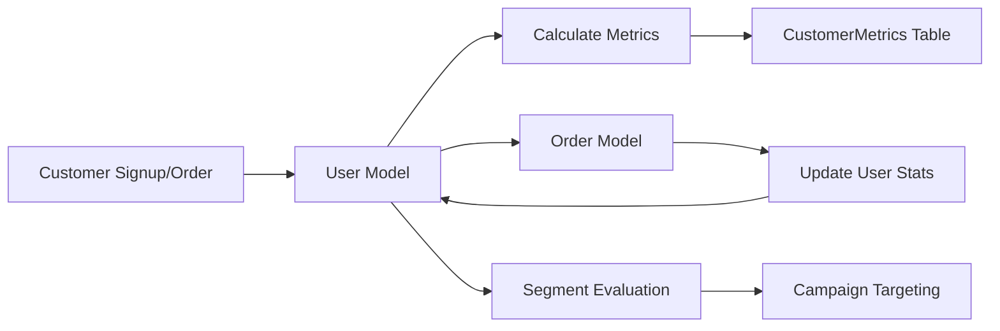
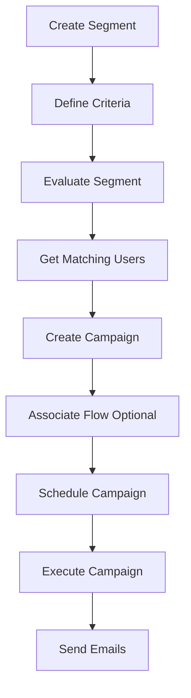
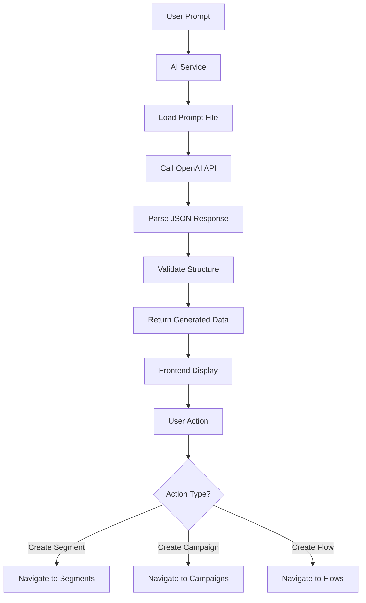
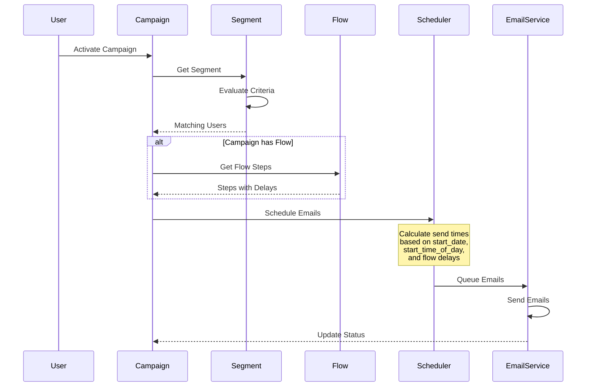

# Data Flow Diagrams

## Customer Data Flow

```mermaid
flowchart LR
    A[Customer Signup/Order] --> B[User Model]
    B --> C[Calculate Metrics]
    C --> D[CustomerMetrics Table]
    B --> E[Order Model]
    E --> F[Update User Stats]
    F --> B
    B --> G[Segment Evaluation]
    G --> H[Campaign Targeting]
```

## Segment to Campaign Flow

```mermaid
flowchart TD
    A[Create Segment] --> B[Define Criteria]
    B --> C[Evaluate Segment]
    C --> D[Get Matching Users]
    D --> E[Create Campaign]
    E --> F[Associate Flow Optional]
    F --> G[Schedule Campaign]
    G --> H[Execute Campaign]
    H --> I[Send Emails]
```

## AI Generation Data Flow

```mermaid
flowchart TD
    A[User Prompt] --> B[AI Service]
    B --> C[Load Prompt File]
    C --> D[Call OpenAI API]
    D --> E[Parse JSON Response]
    E --> F[Validate Structure]
    F --> G[Return Generated Data]
    G --> H[Frontend Display]
    H --> I[User Action]
    I --> J{Action Type?}
    J -->|Create Segment| K[Navigate to Segments]
    J -->|Create Campaign| L[Navigate to Campaigns]
    J -->|Create Flow| M[Navigate to Flows]
```

## Campaign Execution Data Flow

```mermaid
sequenceDiagram
    participant User
    participant Campaign
    participant Segment
    participant Flow
    participant Scheduler
    participant EmailService
    
    User->>Campaign: Activate Campaign
    Campaign->>Segment: Get Segment
    Segment->>Segment: Evaluate Criteria
    Segment-->>Campaign: Matching Users
    
    alt Campaign has Flow
        Campaign->>Flow: Get Flow Steps
        Flow-->>Campaign: Steps with Delays
    end
    
    Campaign->>Scheduler: Schedule Emails
    Note over Scheduler: Calculate send times<br/>based on start_date,<br/>start_time_of_day,<br/>and flow delays
    
    Scheduler->>EmailService: Queue Emails
    EmailService->>EmailService: Send Emails
    EmailService-->>Campaign: Update Status
```
