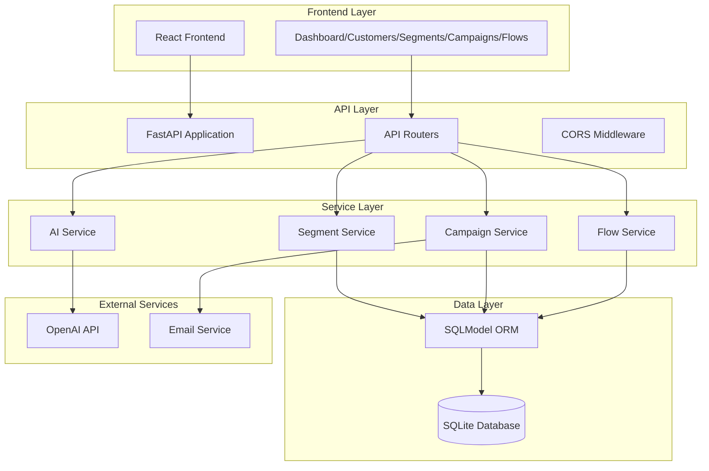
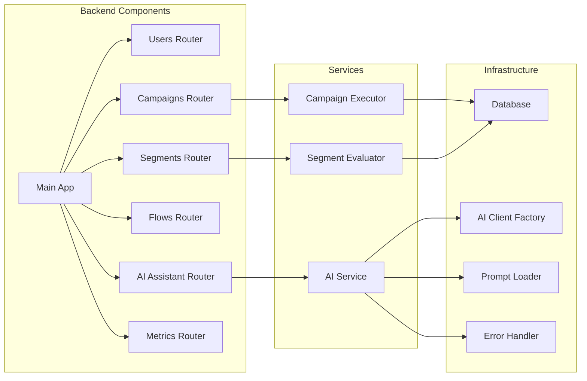
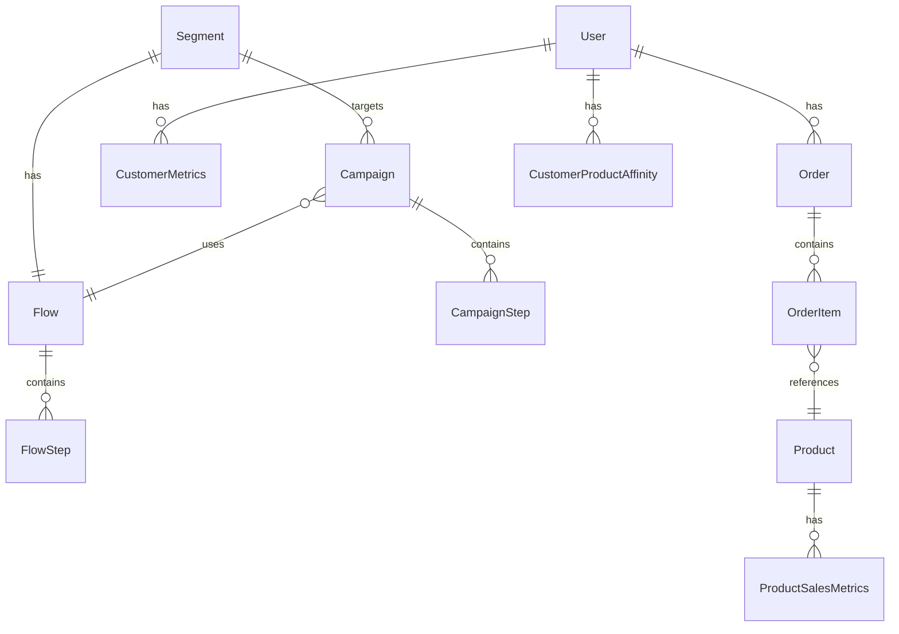

# High-Level Design (HLD)

## System Architecture

## Component Architecture

## Technology Stack

### Backend
- **Framework**: FastAPI 0.115+
- **ORM**: SQLModel (SQLAlchemy + Pydantic)
- **Database**: SQLite
- **AI Integration**: OpenAI SDK (configurable for multiple providers)
- **Environment**: Python 3.8+

### Frontend
- **Framework**: React 19.2.0 with TypeScript 5.9.3
- **Build Tool**: Vite 7.2.4
- **Styling**: Tailwind CSS 3.4.1
- **Routing**: React Router 7.12.0
- **HTTP Client**: Axios 1.13.2

## Core Modules

### 1. User Management
- Customer CRUD operations
- Customer metrics calculation
- Marketing preferences management

### 2. Segmentation Engine
- Dynamic segment creation
- Criteria evaluation (AND/OR logic)
- Real-time segment counting
- Relative date calculations

### 3. Campaign Management
- Campaign lifecycle (draft → active → paused → completed)
- Segment targeting
- Flow association
- Scheduling (date + time)

### 4. Flow Orchestration
- Multi-step email sequences
- Entry condition triggers
- Step types: SEND_EMAIL, WAIT, SEND_PUSH, EXIT
- Ordered step execution

### 5. AI Service
- Segment criteria generation
- Flow content generation
- Campaign strategy generation
- Chat assistant (suggestive)

## Data Model Relationships

## Security & Configuration

- Environment-based configuration (`.env` files)
- API key management (no hardcoded keys)
- CORS configuration for frontend
- Input validation via Pydantic models
