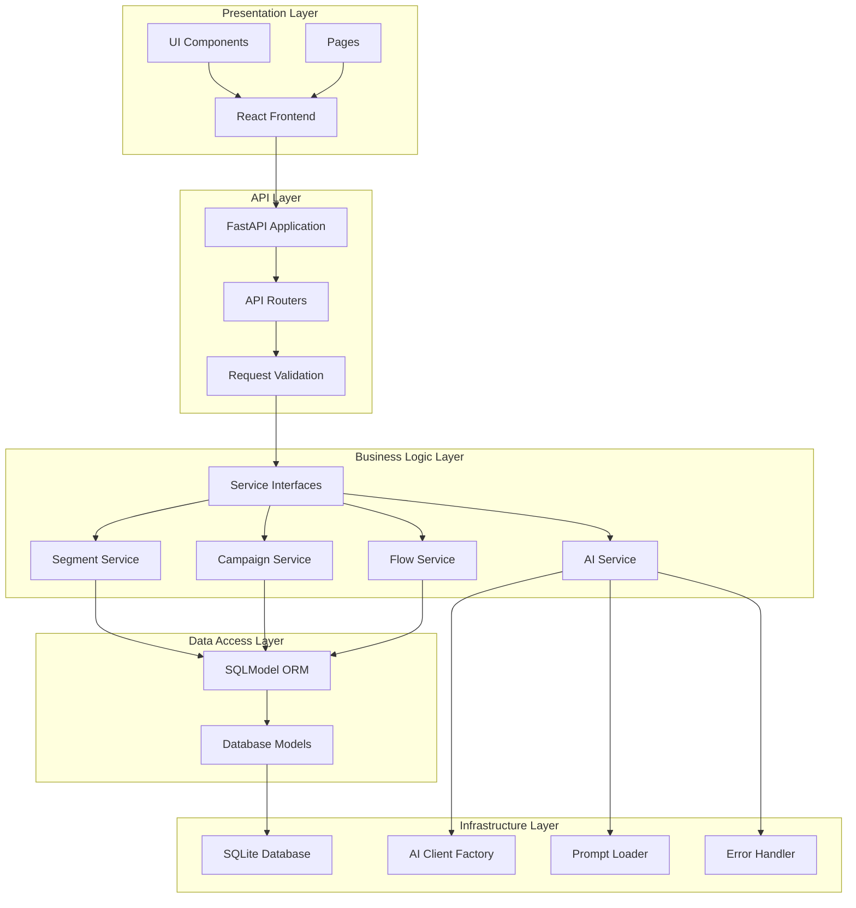
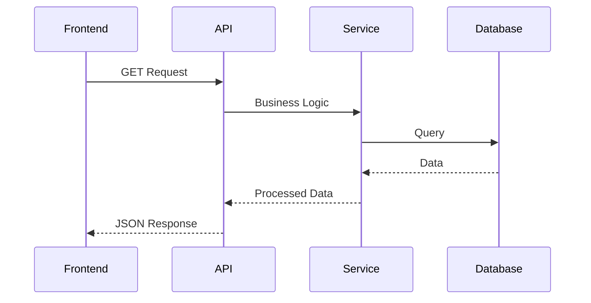
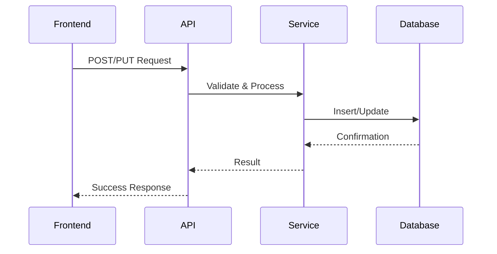
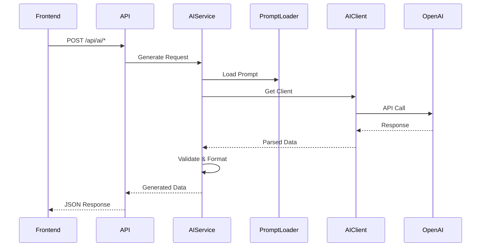

# System Overview

## Architecture Layers

## Core Components

### 1. Frontend (React + TypeScript)
- **Pages**: Dashboard, Customers, Segments, Campaigns, Flows, Analytics, Orders, Inventory, AI Agent
- **Components**: Reusable UI components (Button, Input, Select, Modal, etc.)
- **State Management**: React hooks (useState, useEffect)
- **API Client**: Axios with base URL configuration

### 2. Backend (FastAPI)
- **Routers**: RESTful API endpoints
- **Services**: Business logic implementation
- **Models**: Database schema definitions
- **Database**: SQLite with SQLModel ORM

### 3. AI Integration
- **Service**: Generic AI service supporting multiple providers
- **Client Factory**: Creates OpenAI-compatible clients
- **Prompt Management**: External prompt files for maintainability
- **Error Handling**: Centralized error processing

## Data Flow

### Read Operations

### Write Operations

### AI Generation Flow

## Key Design Patterns

1. **Repository Pattern**: Services abstract data access
2. **Factory Pattern**: AIClientFactory creates clients
3. **Strategy Pattern**: Different AI providers via interfaces
4. **Observer Pattern**: Campaign status changes trigger actions

## Scalability Considerations

### Current Limitations
- SQLite database (single-file, not ideal for high concurrency)
- In-memory segment evaluation (all users loaded)
- Synchronous AI API calls

### Future Enhancements
- PostgreSQL for production
- Background job queue for campaign execution
- Caching layer for segment results
- Async AI API calls
- Database indexes for performance
