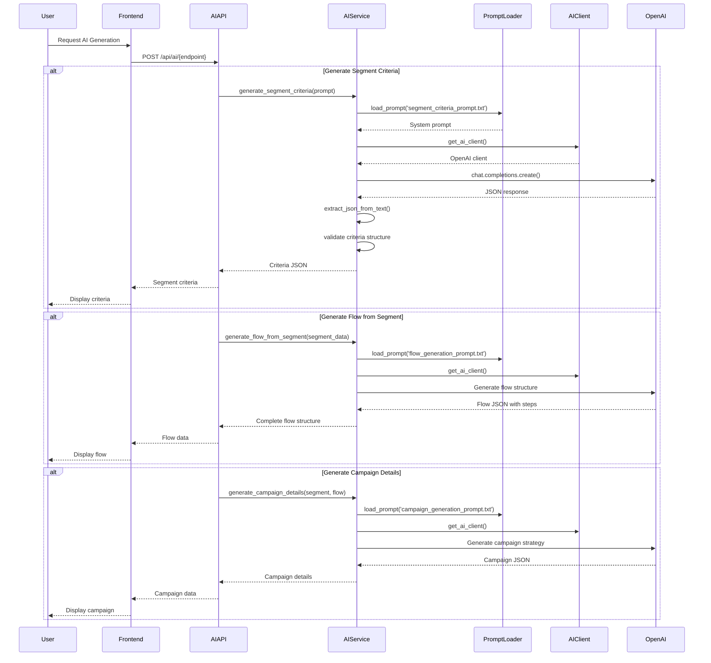
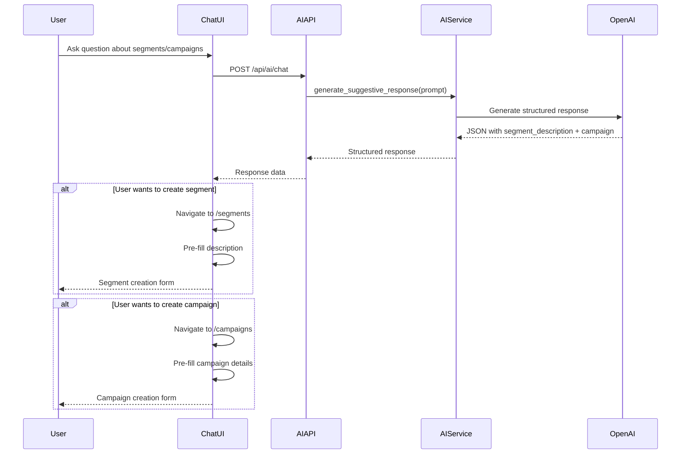
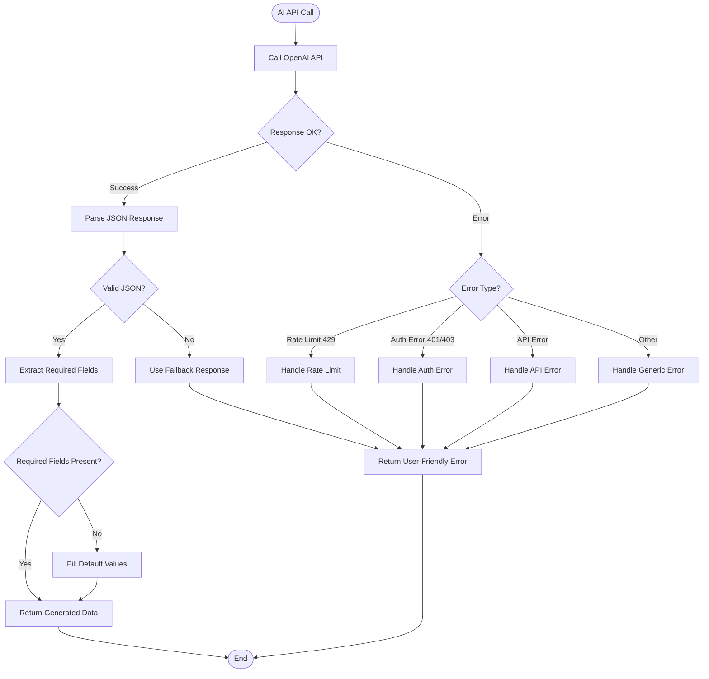

# AI Generation Workflows

## Overview
This document describes how AI is used to generate segments, flows, and campaigns.

## AI Generation Sequence



## AI Chat Assistant Flow



## AI Error Handling



## Prompt File Structure

All AI prompts are stored in `backend/prompts/`:

```
prompts/
├── segment_criteria_prompt.txt    # Segment criteria generation
├── flow_generation_prompt.txt      # Flow generation
└── campaign_generation_prompt.txt # Campaign generation
```

### Benefits:
- ✅ Version-controlled with code
- ✅ Easy to edit without code changes
- ✅ Can be reviewed in PRs
- ✅ Supports multiple languages (future)

## AI Response Formats

### Segment Criteria Response
```json
{
  "logical_operator": "AND",
  "criteria": [
    {
      "field": "total_order_value",
      "operator": "gt",
      "value": 1000
    }
  ],
  "explanation": "High-value customers"
}
```

### Flow Generation Response
```json
{
  "entry_condition_type": "order_completed",
  "name": "Post-Purchase Flow",
  "steps": [
    {
      "step_type": "SEND_EMAIL",
      "step_order": 1,
      "config": {
        "subject": "Thank you!",
        "body_text": "..."
      }
    }
  ]
}
```

### Campaign Generation Response
```json
{
  "name": "VIP Customer Campaign",
  "description": "...",
  "start_time_of_day": "10:00",
  "time_recommendation_reason": "...",
  "marketing_strategy": "...",
  "recommendations": [...]
}
```
