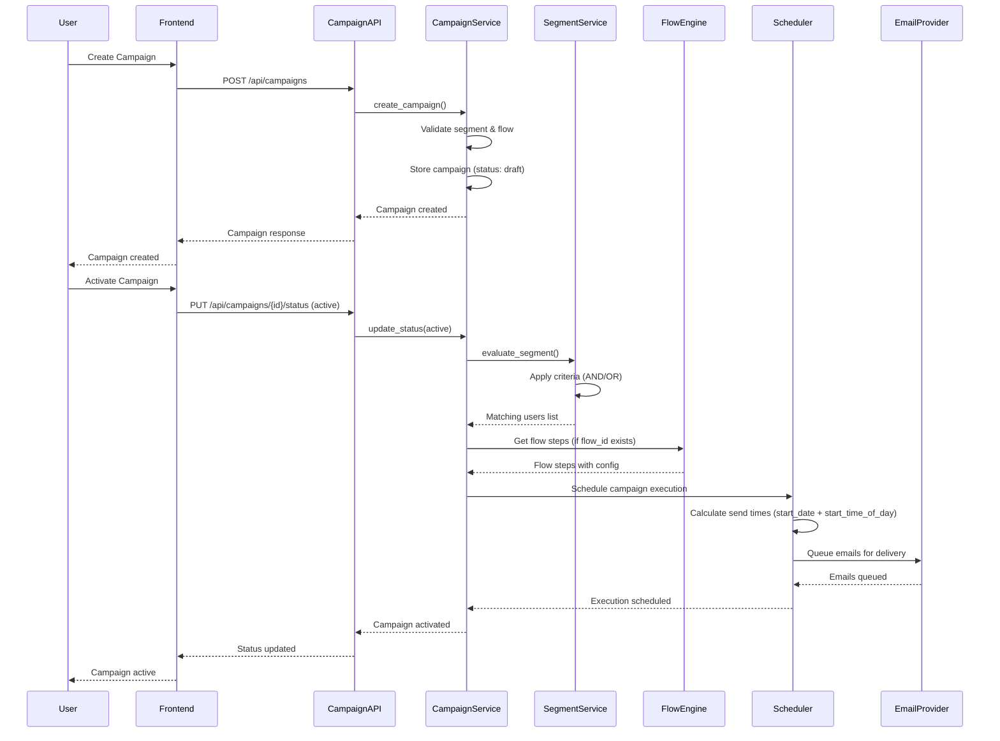
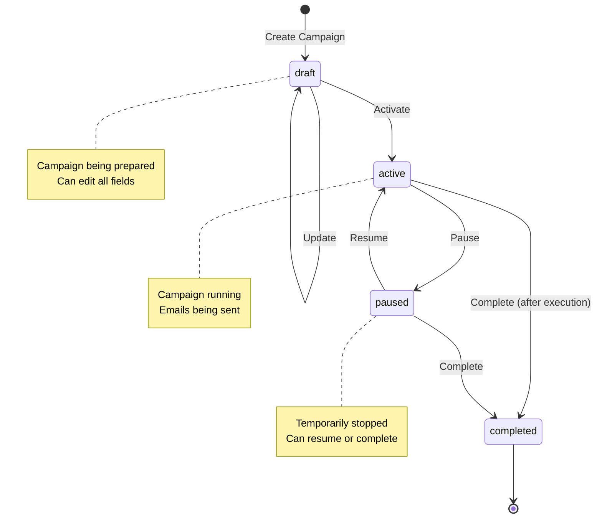
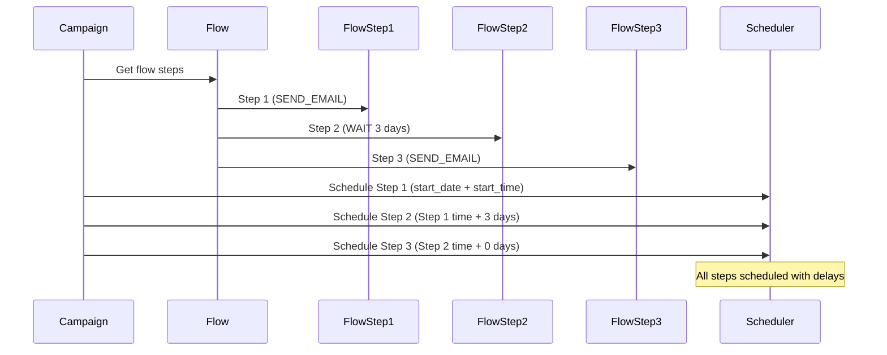

# Campaign Execution Flow

## Overview
This document describes the complete flow of campaign execution from creation to email delivery.

## Campaign Execution Sequence

## Campaign Lifecycle States

## Campaign Execution Steps

### 1. Campaign Creation
- User selects segment
- Optionally selects flow
- Sets campaign name, description
- Chooses start date (manual)
- AI suggests optimal time (optional)

### 2. Campaign Activation
- Status changes: `draft` → `active`
- Segment evaluation runs
- Flow steps retrieved (if flow associated)
- Emails scheduled based on:
  - Campaign `start_date`
  - Campaign `start_time_of_day`
  - Flow step delays (if flow used)

### 3. Email Delivery
- Scheduler triggers at scheduled time
- For each target user:
  - Check marketing opt-in
  - Send email with personalized content
  - Track delivery status

### 4. Campaign Completion
- All emails sent
- Status changes: `active` → `completed`
- Analytics updated

## Flow Integration

When a campaign uses a flow:

## Error Handling

- **Segment not found**: Campaign creation fails
- **Flow not found**: Campaign created without flow
- **No matching users**: Campaign activated but no emails sent
- **Email delivery failure**: Retry logic (future enhancement)
