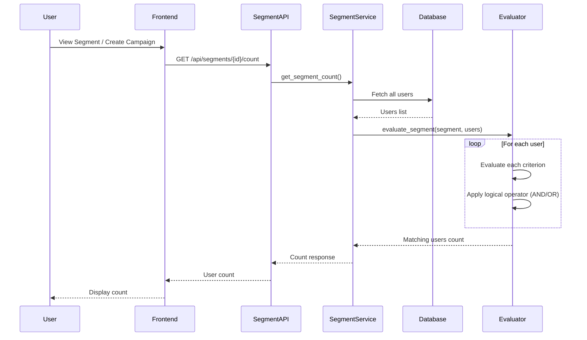
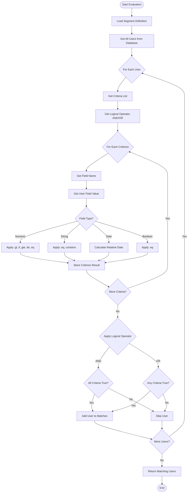
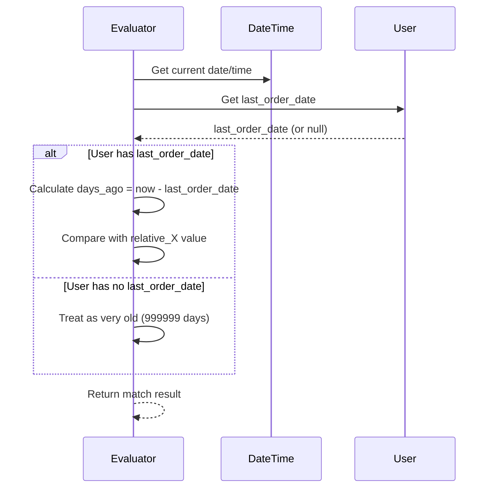

# Segment Evaluation Flow

## Overview
This document describes how customer segments are evaluated against the user database.

## Segment Evaluation Process



## Criteria Evaluation Logic



## Criteria Operators

### Numeric Fields
- `gt`: Greater than
- `lt`: Less than
- `gte`: Greater than or equal
- `lte`: Less than or equal
- `eq`: Equal

### String Fields
- `eq`: Exact match (case-insensitive)
- `contains`: Substring match (case-insensitive)

### Date Fields
- `gt`: After date
- `lt`: Before date
- `eq`: On date
- Supports relative dates: `relative_7`, `relative_30`, `relative_60`, `relative_90`

### Boolean Fields
- `eq`: True/False match

## Logical Operators

### AND (Default)
All criteria must be true for a user to match.

**Example:**
```json
{
  "logical_operator": "AND",
  "criteria": [
    {"field": "total_order_value", "operator": "gt", "value": 1000},
    {"field": "marketing_opt_in", "operator": "eq", "value": true}
  ]
}
```
**Result**: Users with order value > $1000 AND marketing opt-in = true

### OR
At least one criterion must be true.

**Example:**
```json
{
  "logical_operator": "OR",
  "criteria": [
    {"field": "shipping_state", "operator": "eq", "value": "CA"},
    {"field": "shipping_state", "operator": "eq", "value": "NY"}
  ]
}
```
**Result**: Users in California OR New York

## Relative Date Calculations

For `last_order_date` field with relative dates:



## Performance Considerations

- **Real-time Evaluation**: Currently evaluates all users in memory
- **Future Optimization**: 
  - Database indexes on frequently queried fields
  - Caching segment results
  - Background job for large segments
